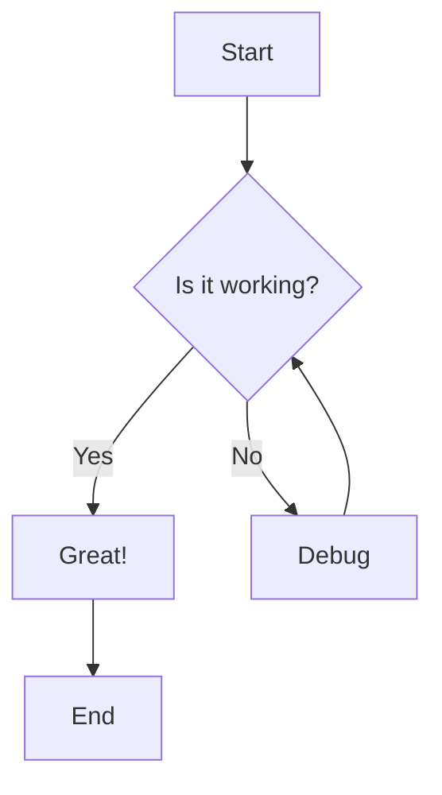

# Sample Markdown File for Testing

This is a comprehensive markdown file demonstrating various formatting options and elements.

## Table of Contents

-   [Headers](#headers)
-   [Text Formatting](#text-formatting)
-   [Lists](#lists)
-   [Links and Images](#links-and-images)
-   [Code Examples](#code-examples)
-   [Tables](#tables)
-   [Blockquotes](#blockquotes)
-   [Other Elements](#other-elements)

---

## Headers

# H1 Header

## H2 Header

### H3 Header

#### H4 Header

##### H5 Header

###### H6 Header

# Alternative H1 Header

## Alternative H2 Header

## Text Formatting

**Bold text using asterisks**

**Bold text using underscores**

_Italic text using asterisks_

_Italic text using underscores_

**_Bold and italic text_**

~~Strikethrough text~~

`Inline code`

==Highlighted text== (if supported)

H~2~O (subscript if supported)

x^2^ (superscript if supported)

## Lists

### Unordered Lists

-   Item 1
-   Item 2
    -   Nested item 2.1
    -   Nested item 2.2
        -   Deeply nested item
-   Item 3

*   Alternative bullet style
*   Another item
    -   Nested with asterisk

-   Plus sign bullets
-   Another plus item

### Ordered Lists

1. First item
2. Second item
    1. Nested numbered item
    2. Another nested item
3. Third item

### Task Lists

-   [x] Completed task
-   [ ] Incomplete task
-   [x] Another completed task
-   [ ] Task with **bold text**

## Links and Images

### Links

[OpenAI Website](https://openai.com)

[Link with title](https://github.com "GitHub Homepage")

<https://www.example.com>

[Reference-style link][1]

[Another reference link][link-ref]

### Images


Reference-style image:
![Reference image][image-ref]

## Code Examples

### Inline Code

Use the `printf()` function to print text. The variable `x` contains the value.

### Code Blocks

```
Plain code block without syntax highlighting
This is useful for generic text or pseudocode
```

```python
# Python code example
def hello_world():
    """A simple function that prints hello world."""
    print("Hello, World!")

    # List comprehension example
    numbers = [i**2 for i in range(10) if i % 2 == 0]
    return numbers

# Class example
class Person:
    def __init__(self, name, age):
        self.name = name
        self.age = age

    def greet(self):
        return f"Hello, my name is {self.name} and I'm {self.age} years old."

person = Person("Alice", 30)
print(person.greet())
```

```javascript
// JavaScript code example
function fibonacci(n) {
    if (n <= 1) return n;
    return fibonacci(n - 1) + fibonacci(n - 2);
}

// Arrow function and modern JavaScript
const greetUser = (name) => {
    return `Hello, ${name}! Welcome to our app.`;
};

// Async/await example
async function fetchData(url) {
    try {
        const response = await fetch(url);
        const data = await response.json();
        return data;
    } catch (error) {
        console.error("Error fetching data:", error);
    }
}
```

```html
<!DOCTYPE html>
<html lang="en">
    <head>
        <meta charset="UTF-8" />
        <meta name="viewport" content="width=device-width, initial-scale=1.0" />
        <title>Sample HTML</title>
    </head>
    <body>
        <header>
            <h1>Welcome</h1>
            <nav>
                <ul>
                    <li><a href="#home">Home</a></li>
                    <li><a href="#about">About</a></li>
                </ul>
            </nav>
        </header>
        <main>
            <p>This is a sample HTML document.</p>
        </main>
    </body>
</html>
```

```css
/* CSS styling example */
.container {
    max-width: 1200px;
    margin: 0 auto;
    padding: 20px;
}

.header {
    background: linear-gradient(45deg, #ff6b6b, #4ecdc4);
    color: white;
    text-align: center;
    padding: 2rem;
    border-radius: 8px;
}

.button {
    background-color: #3498db;
    color: white;
    border: none;
    padding: 10px 20px;
    border-radius: 5px;
    cursor: pointer;
    transition: background-color 0.3s ease;
}

.button:hover {
    background-color: #2980b9;
}
```

```sql
-- SQL example
CREATE TABLE users (
    id INTEGER PRIMARY KEY,
    username VARCHAR(50) UNIQUE NOT NULL,
    email VARCHAR(100) NOT NULL,
    created_at TIMESTAMP DEFAULT CURRENT_TIMESTAMP
);

INSERT INTO users (username, email) VALUES
    ('alice', 'alice@example.com'),
    ('bob', 'bob@example.com');

SELECT u.username, u.email, COUNT(p.id) as post_count
FROM users u
LEFT JOIN posts p ON u.id = p.user_id
WHERE u.created_at > '2023-01-01'
GROUP BY u.id, u.username, u.email
ORDER BY post_count DESC;
```

## Tables

### Simple Table

| Name    | Age | City     |
| ------- | --- | -------- |
| Alice   | 25  | New York |
| Bob     | 30  | London   |
| Charlie | 35  | Tokyo    |

### Table with Alignment

| Left Aligned | Center Aligned | Right Aligned |
| :----------- | :------------: | ------------: |
| Item 1       |     Item 2     |        Item 3 |
| Longer item  |     Center     |       $100.00 |
| Short        |      Mid       |     $1,234.56 |

### Complex Table

| Feature | Basic Plan | Pro Plan     | Enterprise |
| ------- | ---------- | ------------ | ---------- |
| Users   | 5          | 50           | Unlimited  |
| Storage | 10GB       | 100GB        | 1TB        |
| Support | Email      | Email + Chat | 24/7 Phone |
| Price   | $9/month   | $29/month    | Custom     |

## Blockquotes

> This is a simple blockquote.
> It can span multiple lines.

> **Nested blockquote example:**
>
> > This is a nested blockquote.
> > It's useful for showing replies or sub-quotes.
>
> Back to the original quote level.

> ### Blockquote with other formatting
>
> You can include other markdown elements in blockquotes:
>
> -   Lists
> -   **Bold text**
> -   `Code`
> -   [Links](https://example.com)

## Other Elements

### Horizontal Rules

---

---

---

### Line Breaks

This line ends with two spaces  
This creates a line break

This paragraph is separated by a blank line.

### Escape Characters

\*This text is not italic\*

\`This is not code\`

\# This is not a header

### Footnotes (if supported)

This text has a footnote[^1].

Another footnote reference[^note].

### Definition Lists (if supported)

Term 1
: Definition for term 1

Term 2
: Definition for term 2
: Another definition for term 2

### Math (if supported)

Inline math: $E = mc^2$

Block math:

$$
\sum_{i=1}^n i = \frac{n(n+1)}{2}
$$

### Emojis (if supported)

:smile: :heart: :thumbsup: :rocket: :computer:

### HTML Elements (if allowed)

<details>
<summary>Click to expand</summary>

This content is hidden by default and can be expanded by clicking the summary.

You can include markdown here too:

-   Item 1
-   Item 2

</details>

<kbd>Ctrl</kbd> + <kbd>C</kbd> to copy

<mark>Highlighted text using HTML</mark>

### Mermaid Diagrams (if supported)



---

## References

[1]: https://example.com "Example website"
[link-ref]: https://github.com "GitHub"
[image-ref]: https://picsum.photos/500/300 "Reference style image"

[^1]: This is the first footnote.
[^note]: This is another footnote with a custom name.

---

_This markdown file was created for testing various markdown rendering capabilities._

**Last updated:** `2024-01-15`
